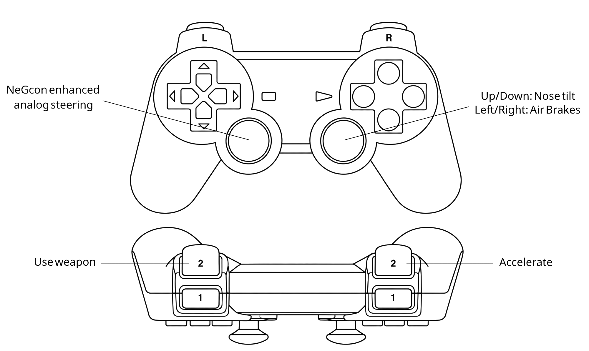

# Wipeout XL Recompiled — Wipeout2K97XL

An unofficial PSXRecomp compatibility project for **Wipeout XL (USA), SCUS-94351**.
Windows 10/11, 64-bit Intel or AMD. OpenBIOS and SDL3.

[Download setup kits](https://github.com/NJH-1001/Wipeout2K97XL/releases/latest) ·
[Report a problem](https://github.com/NJH-1001/Wipeout2K97XL/issues)

## Download and setup

The public artifact is `wipeoutxl-0.1.0-windows-x64.zip`, a **setup kit**, not a
prebuilt copy of the game. Supply your legally obtained USA Redump-style CUE
and all **12 BIN tracks**. Other regions and revisions are not supported.

1. Extract the entire setup ZIP into a writable folder.
2. Install Python 3.11 or newer. Allow disk space for your disc and a local build.
3. Run `Wipeout2K97XL.exe`, keep OpenBIOS selected and select your CUE.
4. Choose **Generate & rebuild**. The wizard can obtain its supported CMake,
   Ninja and Clang toolchain; game code is generated and compiled locally.
5. Reopen the setup executable after compilation. It forwards to the local
   playable build. Keep the kit together and back up your saves before updates.

No disc images, extracted game executable, generated game code, retail BIOS,
memory cards, captures or analysis databases are distributed. Windows setup
binaries are unsigned. [Experimental Linux and macOS previews](https://github.com/NJH-1001/Wipeout2K97XL/releases/tag/v0.1.0-native-preview)
are available for Linux x64 and Intel/Apple Silicon Macs. **Gameplay unverified.** See
[native platform status and setup](docs/native-platforms.md).

### Supported data track

- Boot executable: `SCUS_943.51`
- Track 01 size: `86045568` bytes
- MD5: `bee4ab5e4835235ccf6f16bc8caea5e6`
- SHA-1: `5694008c30fa9896d17afdd6281e4bebb9f63953`

## Controls

Connect a controller before launching; Player 1 automatically selects a
recognized gamepad. Select Keyboard in the launcher to use keyboard controls.
The emulated pad is locked to NeGcon mode. Xbox and the wired PowerA Advantage
Switch 2 controller have been physically tested. Other Switch, PS4 and PS5
models use SDL3 mappings but have not been physically tested here.

The **NeGcon enhanced dual sticks** mod starts with this customizable preset:



[Open the full-size controller diagram](docs/images/negcon-dual-sticks.png).

| Input | Action |
| --- | --- |
| Left stick horizontal | Analog steering |
| Right stick vertical | Pitch |
| Right stick left / right | Right / left air-brake (reversed) |
| L1 / R1 or LB / RB | Left / right air-brake |
| Right trigger | Analog acceleration, when hardware supports it |
| Bottom face button | Full acceleration / menu select |
| Left trigger or left face button | Fire equipped weapon |
| Right face button | Discard weapon (NeGcon A) |
| Top face button | Change view / menu back (NeGcon B) |
| D-pad | Menu navigation and original directional controls |
| Start / Plus / Options / Menu | Start / pause |

Open **Mods** before launching to change stick assignments, brake direction,
brake buttons, trigger assignments and face-button acceleration. Select
**Recommended dual sticks** to restore the preset's behavior, or **Custom** to
use your saved individual choices. **Use input.ini bindings** or disabling this
mod returns to the editable input file. Right-stick steering and braking can
share an axis; disable stick brakes if that is unwanted. Pitch and air-brakes
are digital, matching the game's decoded inputs; steering and throttle are analog.
Changes apply on the next launch. Keyboard and other button bindings remain
editable in `keybinds.ini` and `input.ini`; rebuilds preserve existing files.

Keyboard: WASD/arrows for directions, Space/X for acceleration, Q/E for
left/right air-brakes, Enter for Start and Backspace for Select. See
[controller details](docs/controllers.md) for other button assignments.

## Display mods

- **16:9 Widescreen:** wider 3D view with centered menus and extended loading
  backgrounds. OpenGL required.
- **Extended Draw Distance:** extends road, scenery and billboard visibility.
- **Extended Enemy Ship Distance:** extends ship meshes and exhaust; enable
  Extended Draw Distance as well.
- **CRT Display:** JVC and Sony Trinitron inspired effects. These approximate
  the appearance of MiSTer presets; they are not exact FPGA filter ports.

Visual mods are off by default and can be enabled on the Mods page. The default
renderer is OpenGL with 4x internal resolution and 4:3 presentation. Distance
mods remain experimental: user playtests accepted their results, but exhaustive
track, camera and clipping coverage is not complete. Netplay is not enabled.

## Verification and reporting

See [VERIFICATION.md](VERIFICATION.md) for tested behavior and remaining release
gates. Report OS, CPU/GPU, controller and connection, renderer, enabled mods and
reproduction steps. Do not upload copyrighted game data or private captures.

See [PUBLICATION.md](PUBLICATION.md) for package boundaries and
[THIRD_PARTY.md](THIRD_PARTY.md) for component licenses. The setup kit contains
the modified framework sources used by its local build. No game-project license
is asserted here; dependencies retain their respective licenses.

This project is not affiliated with Sony, Psygnosis or the game's rights holders.


## Building from repository source

```sh
git clone --recurse-submodules https://github.com/NJH-1001/Wipeout2K97XL.git
cd Wipeout2K97XL
git -C psxrecomp apply ../patches/psxrecomp.patch
python psxrecomp/psxrecomp_cli.py generate --project-root . --config game.toml --disc "/path/to/Wipeout XL (USA).cue"
python psxrecomp/psxrecomp_cli.py rebuild --project-root . --config game.toml --build-dir build-release --target psx-runtime --exe-basename Wipeout2K97XL --no-pgo
```

Release kits already contain the patched framework; do not apply the patch again.
